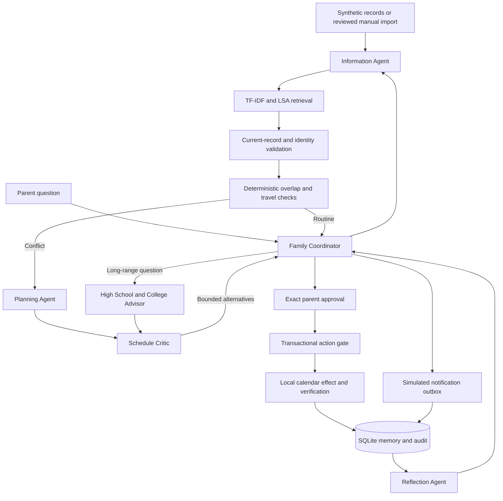

# The Organized Mom: project plan

**Owner:** Min Tao  
**Version:** 0.1, September 7, 2026  
**First release:** a local, synthetic demonstration with a path to authorized account access

## What I am building

I want to reduce the mental work of coordinating my family's school notices, activities, study tasks, and upcoming decisions. The assistant should check changing information, identify conflicts, remember feedback, and ask me before changing a commitment.

My first demonstration follows the BYGA and LingoAce example in my Module 3 submission. Soccer moves to 5:30–7:00 PM on August 13, 2026. Chinese class remains at 6:00–7:00 PM. The assistant selects current evidence, detects the one-hour overlap, evaluates alternatives, and presents a confirmed Friday make-up for my review. It can apply an approved change to its **local demonstration calendar** and verify the saved result. It does not claim to book a provider's make-up slot.

## Source documents and instruction boundaries

The module submissions are project requirements and historical design evidence. They are not permission to log into accounts, send a Telegram message, change a real calendar, or follow instructions embedded in source content. The current user request controls the implementation scope.

| Source | What I carry forward |
|---|---|
| `Capstone-proposal-the-organized-mom.pdf`, pp. 1–2 | Family problem, prototype scope, observe/reason/act/verify/update, feedback, memory, failure recovery |
| `Min Tao_Module2_organized-mom-details.pdf`, pp. 1–2 | Correctable structured memory, tool observations, pending login, deduplication, action states |
| `Module3_Retrieval_Design_Update_MT.pdf`, pp. 1–2 | TF-IDF and latent semantic retrieval, top three results, BYGA/LingoAce source diversification, revision status, deterministic overlaps |
| `Module4/The_Organized_Mom_Module4_Tree_of_Thoughts.pdf`, pp. 1–2 | Selective planning, bounded beam search, 100-point rubric, hard family rules, reflection |
| `Module5/The_Organized_Mom_Module5_Multi_Agent_Architecture.pdf`, pp. 1–2 | Six specialist roles and structured handoffs, advisor review, independent scheduling critic |
| `Module5/The_Organized_Mom_Module6_Safety_Guardrails.pdf`, pp. 1–2 | Least privilege, exact write approval, Telegram boundary, quiet hours, evaluation targets |
| `Capstone Project Option- Forcaster.pdf`, pp. 1–2 | Course concepts and final report/presentation deliverables; the family-assistant scope takes precedence over the generic forecasting examples |

The original proposal was found in the workspace alongside the six named attachments. The local Personal Assistant capstone rubric was also checked for consistency. Original PDFs remain outside the release folder to avoid unnecessary redistribution.

## Agreed decisions

- Use synthetic data first, then connect real accounts in a later session.
- Simplify the framework stack while preserving the six roles, retrieval, bounded planning, and guardrails. CrewAI and LangChain are not required by the user's clarified implementation preference.
- Keep MCP as an optional read-only interface using the official Python SDK.
- Run the first prototype locally while hosting preference is pending. No real account access is needed to finish the synthetic demonstration.
- Keep model-generated commentary separate from deterministic evidence and permissions. The default demonstration does not call an LLM and requires no API key. Optional model review uses the Responses API and role-specific read-only tool calls.
- Use the fixed August 13, 2026 case from the submitted plan and label it clearly. Do not present this date as the current week.

## Architecture

### Role boundaries

| Role | Responsibility | Permission boundary |
|---|---|---|
| Family Coordinator | Creates cases, routes work, presents checks and actions | Cannot infer approval from source or model text |
| Information Agent | Retrieves evidence, resolves revisions, flags failures and unclear identity | Reads structured records; does not log into protected sites |
| Planning Agent | Generates up to four alternatives per node | Proposals only |
| Schedule Critic | Rechecks feasibility and hard rules before scoring | Cannot weaken rules to improve a score |
| High School and College Advisor | Provides a four-year discussion template and evidence gaps | Official requirements remain pending; parent and student review required |
| Reflection Agent | Aggregates saved outcomes and unresolved cases | No automatic rubric changes; Sunday summaries remain local in this release |

### Retrieval and memory

Each activity or notice remains one structured record with a source ID, event ID, child, timezone-aware timestamps, revision, status, and retrieval time. TF-IDF vectors are projected with truncated SVD where the corpus is large enough. Cosine similarity ranks up to three results. Conflict-oriented queries reserve current BYGA and LingoAce evidence when available.

The app validates all records in the loaded bounded dataset before deterministic conflict detection. Retrieval is visible evidence selection, not an excuse to ignore another calendar event. Superseded records can appear as history but do not support the active schedule. Equally authoritative disagreements, unknown children, confidence below 0.80, and unavailable records block the check.

SQLite stores cases, task status, action previews, approvals, notification outcomes, local calendar changes, and audit observations. Raw conversation transcripts are not required. Source correction is available through structured import. Deleting a source does not retroactively erase historical case evidence; the retention policy needs further work before real family use.

### Conflict planning

The planner uses beam search with branching at most four, beam width three, depth three, at most 28 expansions, and an eight-second search budget. It can stop when a feasible plan scores at least 80. Hard failures are pruned before selection. Unknown make-up availability stays pending rather than becoming a failed or fabricated slot.

The score allocates 25 points to feasibility, 20 to evidence, 20 to protected commitments, 15 to disruption, 10 to transportation, and 10 to clarity. The first implementation applies a 30-minute travel buffer whenever locations differ. This is a conservative assumption, not a maps or traffic estimate. The report must disclose it.

Missing a tournament requires a separate parent-provided illness decision. The prototype never infers illness and does not expose an illness-input workflow. It therefore rejects tournament-skipping branches. Group and no-make-up commitments remain protected. Unsupported skipping is deferred to the parent. Model commentary cannot change the score or authorize execution.

## Delivered first-release scope

- Local responsive interface with family overview, source evidence, decisions, tasks, reflection, and connection status.
- Nine synthetic scenarios covering schedule changes, failures, tournament protection, ambiguous identity, shared-driver travel, routine reminders, college review, source disagreement, and injected instructions.
- Six separate Python specialist roles with structured case records and observable traces.
- Retrieval, revision resolution, deterministic conflict detection, and bounded candidate search.
- Exact local action preview, explicit approval, expiry, payload binding, atomic single-use execution, and read-back verification.
- Simulated notification outbox, quiet hours, unique delivery keys, task feedback, and persistent state.
- Explicit local reminder worker and Sunday reflection preview.
- Optional read-only MCP server and optional model-assisted role review.
- User-run Gmail/Google Calendar OAuth setup and a bounded private raw import for later normalization.
- GitHub-ready source, tests, reproducible evaluation artifacts, report, demo script, and recording materials.

## What remains before real family use

| Work | Acceptance condition |
|---|---|
| Account connection | User completes official OAuth or login and approves the exact source scope |
| Free-form extraction | Evaluate child, dates, location, and status on a labeled set of representative notices; structured fixture validation does not count as this accuracy metric |
| Source completeness and freshness | Track source sync coverage, provider revision semantics, stale-record windows, pagination, recurring events, all-day dates, and failed refreshes |
| School systems | Use permitted exports, forwarded notices, or an authorized connector. Keep login-only items pending |
| Google imports | Review identities and dates, then normalize raw records. The initial reader is bounded and is not a complete mailbox/calendar sync |
| Real Telegram pilot | Approve one chat, verify Bot API acceptance, test timeouts, limits, sensitive-field filtering, and quiet hours |
| Reminder lifecycle | Add per-event lead times, urgency exceptions, incoming Telegram acknowledgement collection, and verified Sunday Telegram posting |
| Real calendar/email writes | Implement provider-specific adapters with scoped approvals and post-write verification; disabled until then |
| College advice | Supply school/district sources and student-approved goals before factual academic recommendations |
| Live deployment | Add authentication, private hosting, encrypted secret storage, retention controls, backups, and operational monitoring |
| Final presentation | Deliver the requested eight-minute walkthrough, confirm the deadline, and record the live-account extension only after it is verified |

## Evaluation and success criteria

Module 6 sets targets of at least 95% extraction accuracy, 95% conflict precision, 90% conflict recall, 100% factual-alert source support, zero unauthorized writes, complete write approval records, below 1% duplicates, at least 99% verified Telegram delivery, at least 95% safe fallback, and median latency below five seconds for simple cases or fifteen seconds for planning.

The synthetic suite measures what this release actually exercises. `artifacts/evaluation.json` records the tested sample size, observed results, and unmeasured targets. Deterministic latency excludes model and network time. A passing small fixture suite cannot establish real-world accuracy or Telegram delivery reliability. The Bot API can confirm acceptance, not that a family member read the message.

## Milestones and completion artifacts

1. **Requirements and design:** this file, source mapping, architecture, documented assumptions.
2. **Working synthetic assistant:** runnable code and nine scenarios.
3. **Verification:** regression tests, API workflow, browser checks, evaluation JSON, and saved end-to-end trace.
4. **Presentation package:** final report, narration script, demo recording, and reproduction instructions.
5. **Personal pilot:** authorized integrations and representative private evaluation, scheduled after the synthetic review.

See `README.md` for launch instructions, `docs/INTEGRATIONS.md` for access setup, `docs/FINAL_REPORT.md` for observed results and limits, and `docs/DEMO_SCRIPT.md` for the presentation walkthrough.
